# CyberLens frontend redesign

The redesigned application runs at http://localhost:3000. Existing Spring Boot endpoints, text/URL/image scan payloads, JWT authentication, search, and STOMP subscriptions remain connected to the running stack.

## Before / after by page

| Page | Before | After |
| --- | --- | --- |
| Dashboard | Basic KPI cards, embedded state map, older charts and feed. | Intelligence workspace with comparison arrows, daily activity line, category donut, state bars, live feed, and map navigation. |
| Live Heatmap | State-level map embedded in the dashboard. | Dedicated expandable Leaflet map, dark/light tiles, severity heat layer, clustered incident markers, category/severity/time/state filters, and detail drawer. |
| Incidents | Search results displayed as threat cards. | Filterable incident table, severity badges, pagination, CSV export, preview drawer, and detail route with AI summary, source, confidence, and timeline. |
| Report Cybercrime | No report page or report submission API. | Four validated steps, progress indicator, review, local summary download, and handoff to the official reporting portal. The interface explicitly says the report has not been submitted. |
| Scam Checker | Separate basic text, URL, and image forms/results. | Unified scanner workspace, examples, image upload/drop zone, animated risk gauge, explanations, detected signals, and actionable error/loading feedback. |
| Awareness Hub | No dedicated page. | Six practical guides, KYC scam awareness spotlight, accessible guide dialogs, official CERT-In resources, and the 1930 helpline card. |
| Trends | Existing chart page with a separate visual treatment. | Consistent intelligence charts, period controls, real totals, export, skeletons, and retry states. |
| Search | Standalone card results. | Existing keyword search API integrated into the incident explorer, with filtering and detail navigation. |
| Shared layout | Fixed sidebar and basic header. | Collapsible sidebar, global search, live alert count and notifications drawer, real sign-in/register/sign-out, theme persistence, mobile bottom navigation, and skip link. |

## Visual comparisons

### Dashboard

Before:

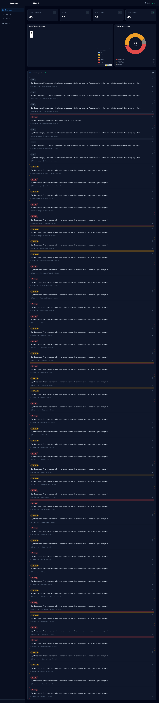

After:

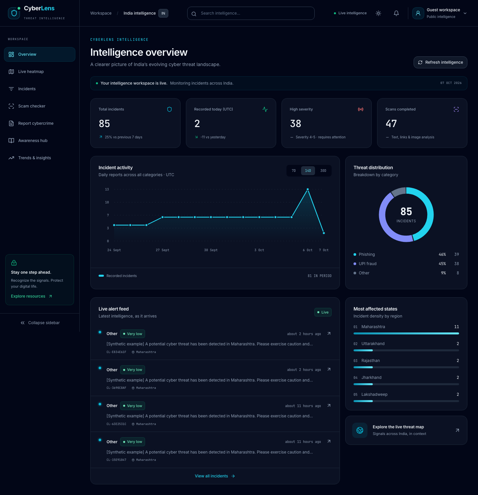

[Light mode](redesign/after-dashboard-light.png) · [Mobile](redesign/after-dashboard-mobile.png)

### Live Heatmap

Before: the map was embedded in the [old dashboard](redesign/before-dashboard.png).

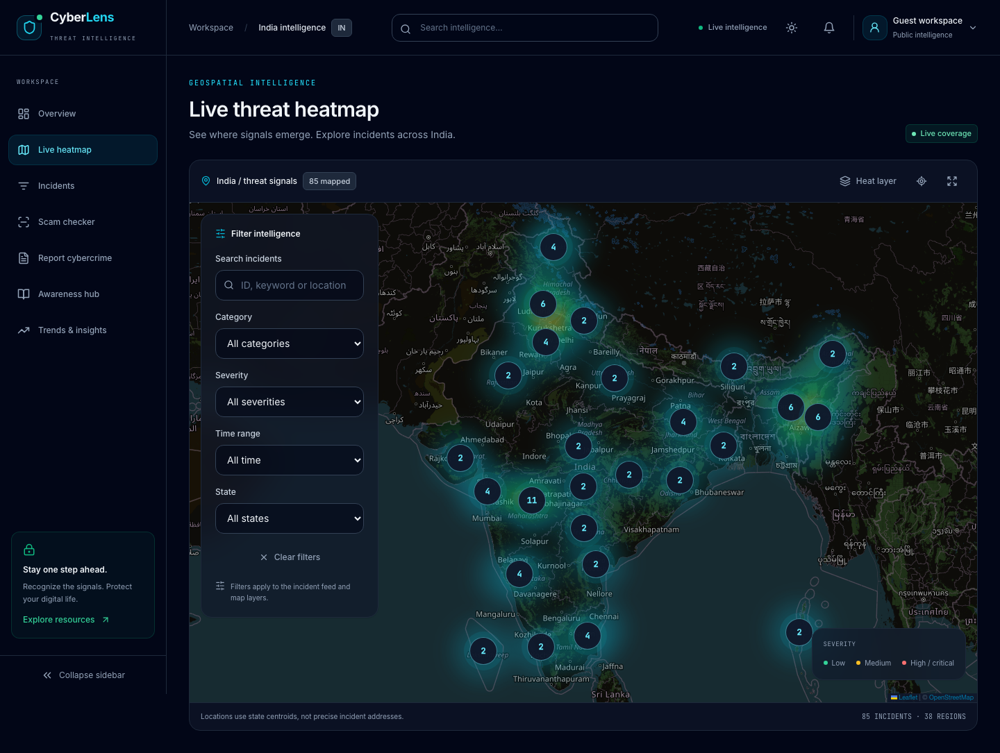

[Mobile map](redesign/after-heatmap-mobile.png)

### Incidents and detail

Before:

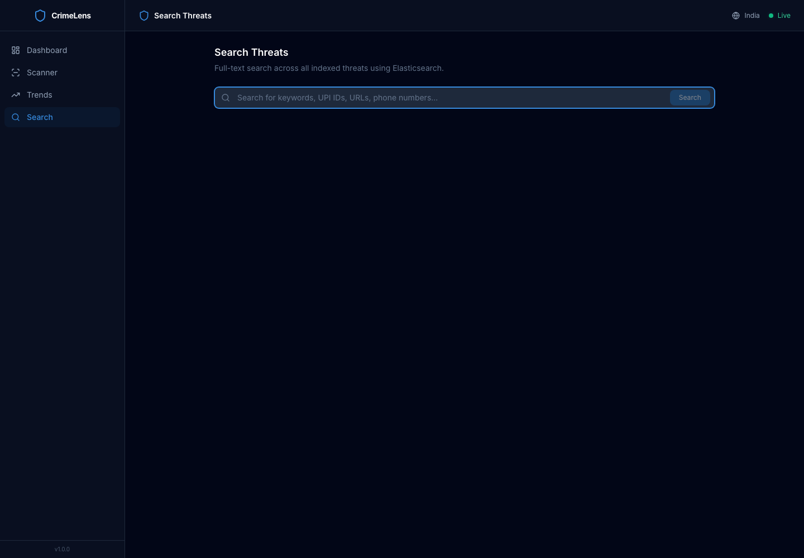

After:

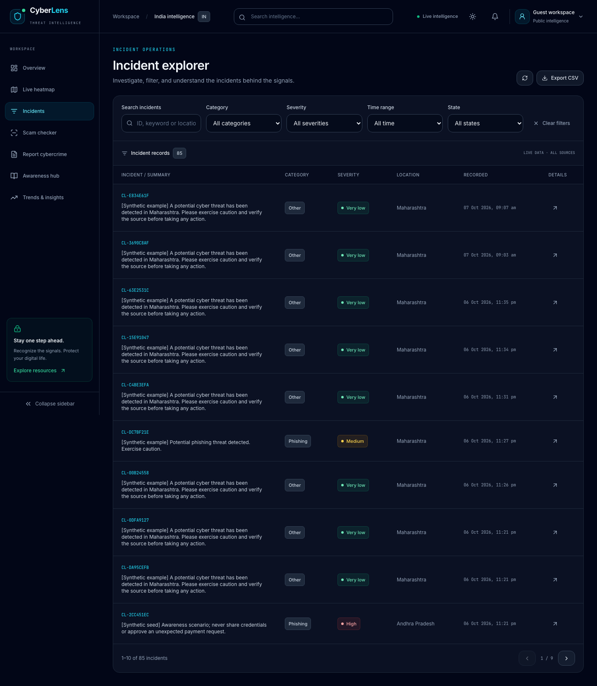

[Detail page](redesign/after-incident-detail.png) · [Drawer](redesign/after-incident-drawer.png) · [Mobile](redesign/after-incidents-mobile.png)

### Report Cybercrime

Before: no report page existed.

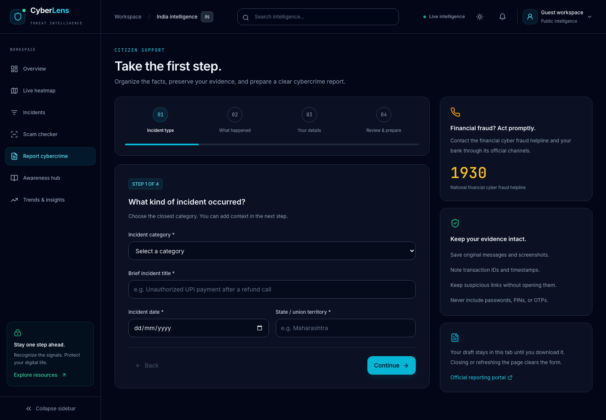

[Mobile](redesign/after-report-mobile.png)

### Scam Checker

Before:

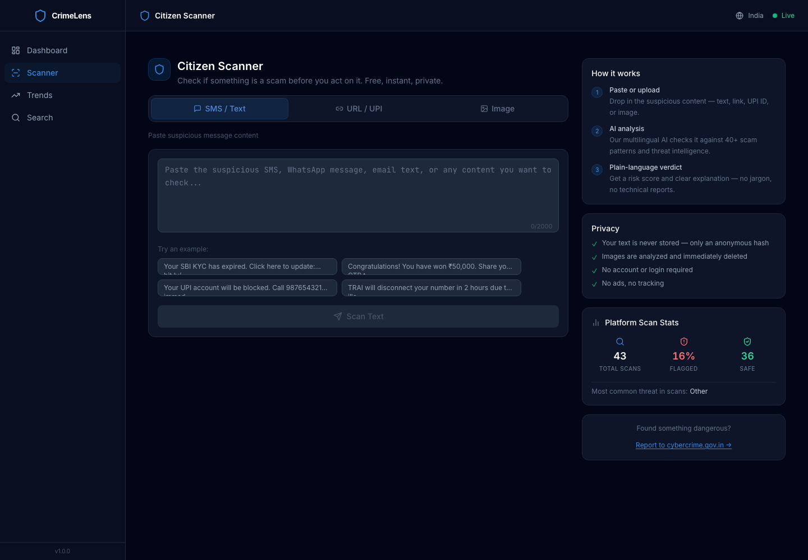

After:

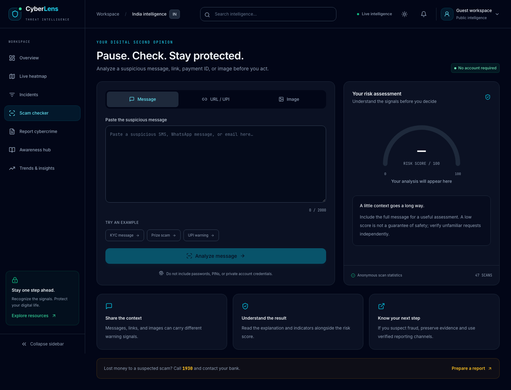

[Analyzed result](redesign/after-scam-result.png) · [Mobile](redesign/after-scam-checker-mobile.png)

### Awareness Hub

Before: no awareness page existed.

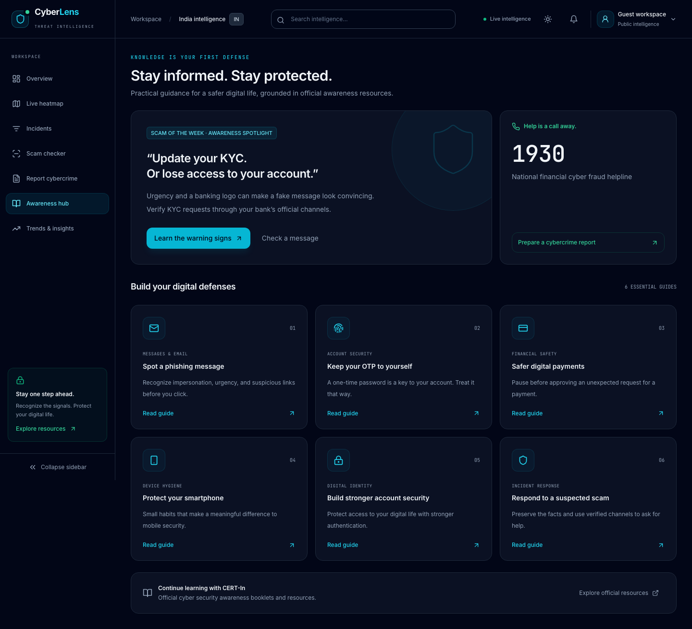

[Mobile](redesign/after-awareness-mobile.png)

### Trends

Before:

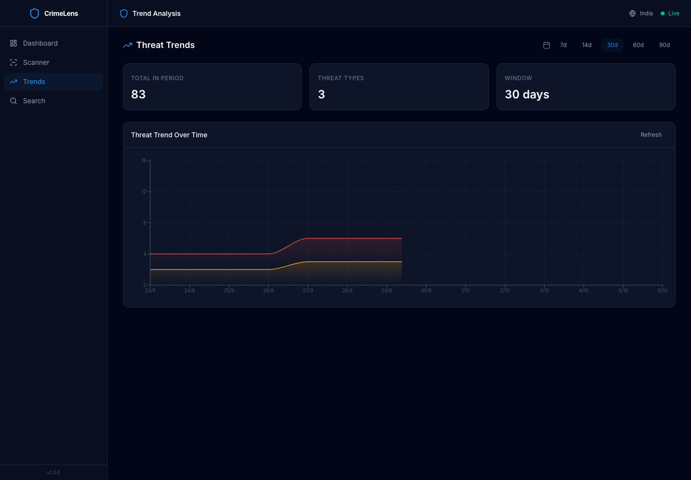

After:

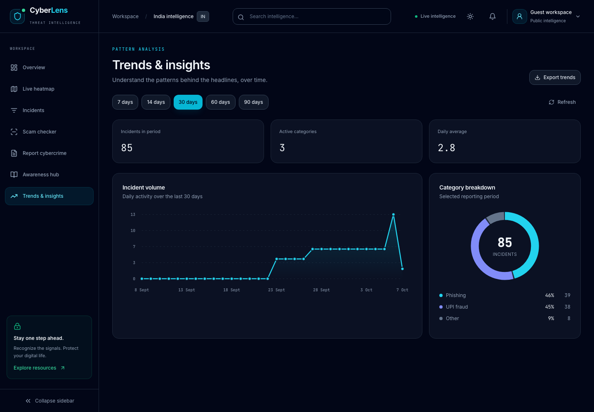

### Search

Before: the [original search page](redesign/before-search.png).

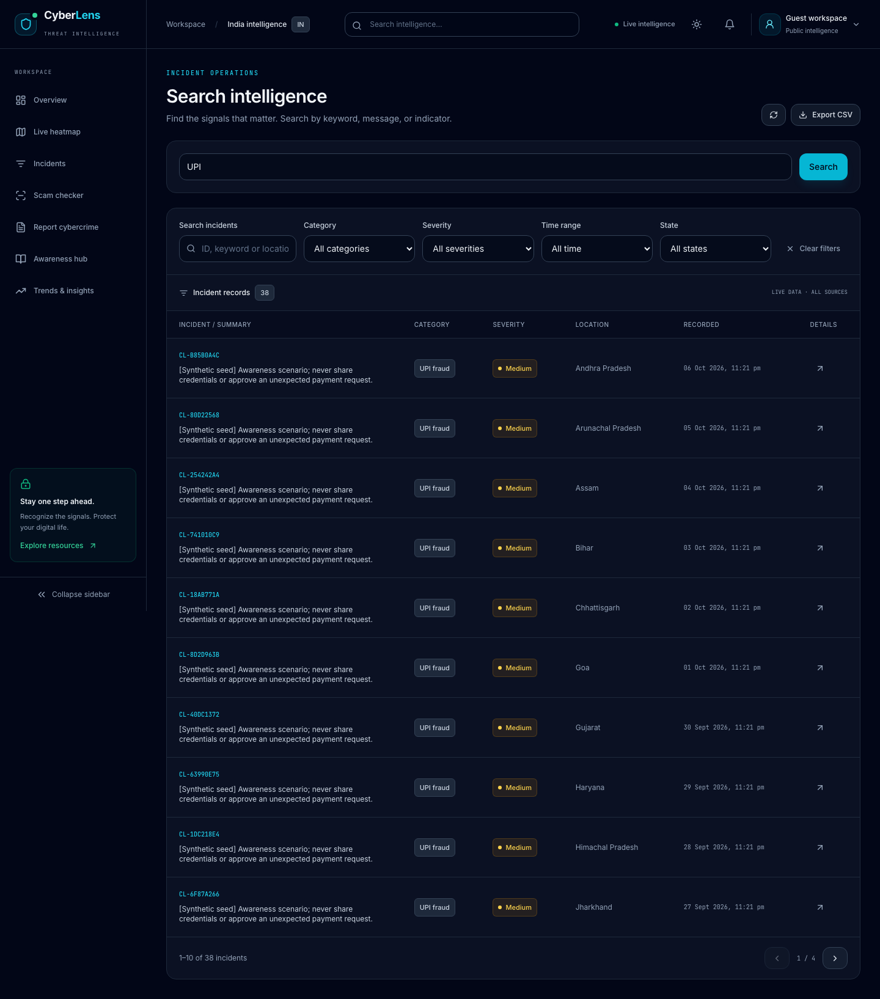

## Implementation and integration notes

- Inter and JetBrains Mono are bundled locally, so rendering does not depend on a remote font service.
- Shared Tailwind components live under `frontend/src/components/ui`; page routes load lazily.
- All incident pages are fetched in batches and deduplicated before category, severity, date, state, and keyword filtering.
- The WebSocket subscriber supports multiple listeners per topic, preserving live statistics and incident updates together.
- Trend requests discard stale responses when a time-period selection changes; daily buckets use UTC to match the backend’s statistics.
- Error states provide retry actions; refresh toasts report failures accurately.
- The former map provider served “API key required” images. OpenStreetMap tiles now render with dark styling, without a tile-provider secret.
- Map markers use the API’s state centroids. The interface states that these are not precise incident addresses.
- Timelines display only the recorded timestamp supplied by the API and do not invent classification times.
- Superseded components/hooks and the unused Recharts dependency were removed.
- Report preparation is local: the backend provides no complaint-submission endpoint. No success message pretends a complaint was filed.
- Awareness content links to [CERT-In resources](https://cert-in.org.in/AwarenessBooklets.jsp) and the [official reporting portal](https://www.cybercrime.gov.in/Webform/Index.aspx).

## Run and verify

From the repository root:

```sh
./scripts/init-env.sh
docker compose up -d --build
./scripts/smoke-test.sh
```

Frontend checks, with the Docker stack running:

```sh
cd frontend
npm ci
npm run lint
npm run build
npx playwright install chromium
npm run test:browser
```

To use an existing frontend server at a different URL:

```sh
UI_BASE=http://localhost:5173 npm run test:browser
```

Browser tests use real backend APIs for registration/login/logout, incident details, and text/URL/image scans. They also verify map marker selection, full-screen mode, CSV downloads, report validation/download, mobile bounds, focus trapping, and feed loading/error/retry/empty states. They create uniquely named test users and anonymous scan records.

The automated accessibility pass checks all eight routes in dark and light mode against WCAG 2 A/AA and WCAG 2.1 AA rules. Passing automated checks does not replace a complete manual assistive-technology audit. [Browser verification record](redesign/verification.json) · [Live notification verification](redesign/live-verification.json).

## Verified results

- [x] Production Docker frontend built and started.
- [x] Frontend lint and production build passed.
- [x] All eight repeatable Playwright tests passed against port 3000.
- [x] Eight routes passed automated accessibility checks in both themes (16 audits).
- [x] No frontend browser console warnings or errors during route checks.
- [x] All eight mobile routes fit a 390px viewport; navigation focus trapping passed.
- [x] Real registration, login, logout, incident detail, CSV export, text/URL/image scan, report download, map marker, loading/error/retry/empty-state flows passed.
- [x] All 14 Compose containers passed health checks in the smoke test.
- [x] Ingestion appeared in incidents and geolocated heatmap through the frontend proxy.
- [x] Real live ingestion incremented the bell count, populated notifications, and cleared the unread count on opening.

Notification contrast fix (8 October 2026): corrected dark-mode root text inheritance and gave toast cards explicit text colors and opaque backgrounds. The full-screen map notification regression test passes in both themes.
