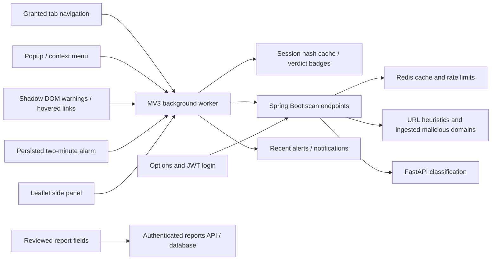

# CyberLens Shield

Manifest V3 client for the existing CyberLens backend. React, TypeScript, Vite and Tailwind; all JavaScript and fonts are bundled locally. Chrome/Edge use a service worker and side panel; Firefox 140+ uses a background module and sidebar.

## Build and install

Use Node 22.12+ and the repository's configured `.env` (never put secrets in the extension).

```sh
# From the repository root
docker compose up -d --build
npm --prefix extension ci
npm --prefix extension run build
```

Chrome: open `chrome://extensions`, enable Developer mode, choose **Load unpacked**, select `extension/dist`. Edge: the same steps at `edge://extensions`. Pin Shield and open its popup on a website. Default backend: `http://localhost:8080`; dashboard: `http://localhost:3000`.

Open Shield options to save another backend URL and approve its host access. For a different default build configuration:

```sh
SHIELD_BACKEND_URL=https://api.example.com SHIELD_DASHBOARD_URL=https://dashboard.example.com npm --prefix extension run build
npm --prefix extension run zip
npm --prefix extension run zip:firefox
```

Packages: `extension/packages/cyberlens-shield.zip` and `cyberlens-shield-firefox.zip`, with the manifest at the archive root. Packages are ready for store submission; store accounts, listing, privacy declarations and publication remain the owner's responsibility.

Firefox: `npm --prefix extension run build:firefox`, open `about:debugging#/runtime/this-firefox`, **Load Temporary Add-on**, select `extension/dist-firefox/manifest.json`. Open the Shield sidebar from Firefox's sidebar menu. Temporary installations disappear on restart; permanent Firefox installation requires Mozilla signing.

Automatic scans and warnings require **optional access to the specific website**, granted in options or from the popup. No global website access is required on installation. Opening the popup grants temporary active-tab access for a manual scan. Browser internal pages cannot be injected. Warnings advise the user; they do not block the initial network request or replace browser Safe Browsing.

## Architecture



Navigation is debounced 500 ms; URL results are cached for ten minutes, up to 200 entries, in browser-session storage under SHA-256 keys. Failed scans expire after 15 seconds. Hover checking is optional, up to 20 links per page, batched four at a time. Background URL scans use a local 24-request/minute budget. Alarm polling detects new severity 4–5 alerts, remembers at most 200 incident IDs, and avoids notifying every historical incident on first use. No service-worker intervals or persistent socket connections are used. The open side panel refreshes every 30 seconds.

The typed client uses a 15-second timeout and retries a network/5xx failure once. It does not retry 401, 403 or 429, or report submission. Offline is an explicit state, never a fabricated SAFE verdict. The score ring displays **risk**, so higher is worse. Allowlisting skips backend analysis and is labelled as a local policy; a blocklist match takes precedence.

## API

| Endpoint | Access | Response |
| --- | --- | --- |
| `POST /api/scan/url` `{ "url": "https://example.test" }` | Anonymous or JWT | `{verdict, score, reasons, category}` |
| `POST /api/scan/text` `{ "text": "…" }` | Anonymous or JWT | Same verdict shape |
| `GET /api/alerts/recent?limit=10` | Public | Recent incident array; limit 1–50 |
| `GET /api/stats/summary` | Public | Existing dashboard statistics |
| `POST /api/reports` | JWT required | 201: receipt ID, status, time and message |

URL checks combine protocol, punycode, IP hosts, TLD, length, credentials, impersonation and verification/reward signals with known malicious URLs extracted from high-severity ingested incident descriptions, then AI classification. The server does not fetch the submitted URL. Scores are bounded 0–100; SAFE <30, SUSPICIOUS 30–69, DANGEROUS ≥70. AI unavailability produces explicit limited analysis and at least SUSPICIOUS. Redis scan cache lives ten minutes (30 seconds for degraded AI results). Redis rate limits are 30 anonymous scans/minute per direct client IP and 90 authenticated scans/minute per account; an in-process limiter takes over during Redis outages. Deployments behind a proxy must configure trusted client-address handling rather than trust arbitrary forwarded headers.

JWT login uses the existing `/api/auth/login`; session tokens are bound to the backend URL and removed on backend change or 401. Anonymous reports receive 401. Reports save reviewed URL, title, description, category, optional state/email and submitter to the `citizen_reports` migration; they do **not** file an official complaint. The report page links to the official portal and helpline **1930**.

## Permissions and privacy

| Permission | Purpose |
| --- | --- |
| `activeTab` | Read current URL/title and manually inject protection after opening the popup |
| `storage` | Preferences, session JWT/verdict cache and seen incident IDs |
| `alarms` | Poll alerts every two minutes across worker suspension |
| `notifications` | Requested context-check results and new severe alerts |
| `contextMenus` | Explicit link and selected-text checks |
| `sidePanel` | Chrome/Edge intelligence panel; omitted in Firefox sidebar build |
| `webNavigation` | Detect top-frame navigation on sites with user-granted access |
| `scripting` | Inject the packaged content script on granted sites or the active tab |
| Required host access | Only the configured backend origin at build time |
| Optional host access | Individual HTTP(S) sites granted by the user and a changed backend origin |

Automatic page protection sends **only the URL**, never page contents; browsing history is not stored. URL query strings can contain sensitive information: the complete URL is needed for the requested scan, so use a backend you trust. Hover checks send hovered target URLs when enabled. Selecting **Check selected text** explicitly sends that selected message; reports explicitly send only the fields you review, including title/contact details. No screenshots, cookies, passwords from websites or page bodies are captured. Login credentials go only to the configured backend, and are not stored. The side panel loads map tiles from OpenStreetMap, which receives tile requests. Firefox's data categories accurately declare these explicit login/text/report actions as well as URL checks.

CSP permits only local scripts, forbids eval/object content, bundles fonts and libraries, and permits inline styles for Leaflet positioning and dynamic visual styles. Network CSP permits configured HTTP(S) backends; browser host permissions still enforce access. Shadow DOM isolates warning styles; tab messages are checked against the sending tab URL.

## Tests

```sh
npm --prefix extension test
cd extension
npx playwright install chromium
npm run test:browser
cd ..
mvn -f backend/pom.xml test
docker compose exec -T ai-service pytest -q
bash scripts/smoke-test.sh
```

Browser tests require a running backend. They copy the built extension into a temporary directory and grant only a local fixture origin in that copy; the shipped manifest remains backend-only. They exercise real navigation, the danger overlay, worker messaging, popup result, Leaflet data, JWT login and persisted report submission. `CHROMIUM_EXECUTABLE` can select an already installed full Chromium binary. URL heuristic unit tests are in `backend/src/test/java/com/crimelens/backend/shield/UrlHeuristicsTest.java`; client tests cover permissions, domain boundaries, hashing, retry, rate-limit and backend-bound token behavior.

Manual cross-browser and notification checks: [manual-test-checklist.md](manual-test-checklist.md).

## Verification on 2026-10-08

- Spring Boot: 58 tests passed, including URL heuristics, known-bad matches, Redis cache, AI outage and rate-limit fallback.
- FastAPI: 32 tests passed; three existing dependency/configuration warnings remain.
- Extension: eight unit tests passed; the unpacked Chromium integration test passed against the running backend with no page JavaScript errors.
- Live endpoints: URL/text verdicts, recent alerts, summary statistics, invalid-limit 400, anonymous-report 401 and Chrome/Firefox-origin CORS preflights passed.
- Existing Compose ingestion smoke test passed; all 14 containers were healthy.
- Existing React dashboard: all eight browser regression tests passed, including API integration and notification contrast.
- Both production builds and ZIP archives passed manifest/required-host and archive-root checks; npm dependency audit found zero vulnerabilities.
- Native Edge/Firefox execution, operating-system notification delivery and store signing remain manual checks; their builds are provided but those checks have not been executed here.

Corrections made during verification:

- Explicit HTTP-client bean selection fixes Spring startup when multiple RestTemplate beans are present.
- Extension-origin recognition allows options/sidebar pages opened in tabs while keeping website scripts restricted to their own page scans.
- Checking a context-menu link preserves the source tab's current-page safety badge.
- Report prefill uses the popup's reviewed URL/title without enumerating unrelated tabs.
- Current Vite/Tailwind/Vitest versions remove dependency audit findings and obsolete build warnings.

### HTTP and failed-navigation correction

HTTP contributes 30 risk points and cannot receive SAFE from backend URL analysis. Brand domains hidden in a path are flagged when the actual host is not an official brand domain. Navigations clear prior badges; failed loads display analysis unavailable instead of keeping green OK. Backend and extension cache keys were versioned so old verdicts are not reused. Browser connection/certificate indicators are separate from URL heuristics; HTTPS alone does not guarantee safety.
